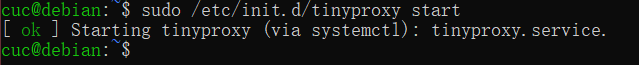
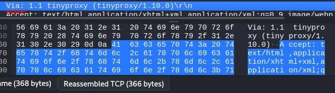

## HTTP代理服务器实验

### 实验要求

Q：使用http代理服务器访问HTTPS站点时，通信传输内容是否会被代理服务器“看到”？

A：结论是代理服务器不知道客户端和服务器的HTTPS通信内容，但代理服务器知道客户端访问了哪个HTTPS站点，这是由http代理的协议机制决定的：代理客户端会发送Connect请求到http代理服务器。

实验验证：在Kali Linux中安装tinyproxy，然后用主机设置浏览器代理指向tinyproxy建立的HTTP正向代理，在Kali中用wireshark抓包，分析抓包过程，理解HTTP正向代理HTTPS流量的特点。

提醒注意：

> HTTP代理服务器在转发客户端请求时，可能会添加Via字段，从而向目标站点暴露客户端正在使用代理访问。类似的，匿名通信应用tor的部分出口节点也会在http请求中自动加入via字段，向被访问站点宣告：当前请求正在使用匿名通信网络tor提供的匿名通信服务。

### 实验环境

- 网络拓扑

  | 虚拟机名称     | IP             |
  | -------------- | -------------- |
  | Gateway-Debian | 192.168.79.10  |
  | victim-kali    | 172.16.111.100 |
  | attacker_kali  | 10.0.2.15      |

- 测试连通性

  - attacker可以连接到gateway并可以上网

    

  - attacker无法连接到victim

    

  - gateway可以连接到victim和attacker

    

  - victim可以连接到gateway并且可以上网，无法连接attacker

    


### 实验过程

- 网关上安装tinyproxy

  ```
  sudo apt install tinyproxy
  ```

  

- 配置文件修改

  - 编辑tinyproxy，取消Allow 10.0.0.0/8行首注释

    ```
    sudo vim /etc/tinyproxy/tinyproxy.conf
    ```

    

    

  - 开启tinyproxy服务

    ```
    sudo /etc/init.d/tinyproxy start
    ```

    

- attacker

  - 在浏览器preference中输入connection搜索connection settings

  - 选择**Manual proxy configuration**，并在 HTTP Proxy一栏输入网关的NAT网络地址，端口和 **tinyproxy.conf**文件中的一致

    

- victim

  - 开启服务

    ```
    sudo service apache2 start
    ```

    
    
  - 在victim完成

    ```
    cd /var/www/html
    sudo touch server.php 
    sudo vim server.php
    php -S 0.0.0.0:8080
    ```

    

    

- attacker抓包

  ```
  sudo tcpdump -i eth0 -n -w 1.pcap
  ```

  

  - 访问victim

    

  - 抓包结束，分析抓包结果

    

    

  - 能看到代理`1.1 tinyproxy (tinyproxy/1.10.0)`

- 网关，抓包并分析

  ```
  sudo tcpdump -i enp0s3 -n -w 2.pcap
  
  # 复制文件到本机桌面上
  scp cuc@192.168.56.113:/home/cuc/2.pcap ./
  ```

  

  

  - 网关（代理服务器）行为分析

    > 1.网关保留HTTP GET请求内容，若攻击者主机（客户端）的浏览器不清除历史记录，则下次访问同样的HTTP服务时用时非常短
    >
    > 2、若在网关设置防火墙规则过滤攻击者主机（客户端）发出的的请求，则攻击者主机（客户端）依然无法访问靶机端（服务器）的HTTP服务
    >
    > 3.代理层可以理解HTTP报文

- Victim抓包

  - 抓包分析

    

  - Victim-kali-1服务器行为分析

    > 1.HTTP协议中出现Via字段，说明网关（代理服务器）正在提供代理服务
    >
    > 2.攻击者主机IP地址、以太网接口均未暴露

- Attacker

  - 访问www.cuc.edu.cn,抓包分析，通过代理访问HTTPS站点

    

  - HTTPS服务建立连接后，用户与网站进行加密通信

### 问题

1. 输入sudo apt-get update后出现仓库将其'Suite'值从'testing'修改到了'stable'

   

### 参考

[第三章实验指南](https://c4pr1c3.github.io/cuc-ns/chap0x03/exp.html)

[输入sudo apt-get update后出现仓库将其'Suite'值从'testing'修改到了'stable'](https://blog.csdn.net/weixin_44513216/article/details/105607807)

[CUCCS/2021-ns-public-Tbc-tang](CUCCS/2021-ns-public-Tbc-tang)
