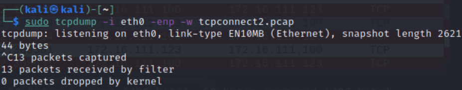
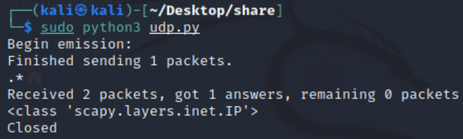

# 基于 Scapy 编写端口扫描器

## 实验目的

- 掌握网络扫描之端口状态探测的基本原理

## 实验环境

- python + [scapy](https://scapy.net/)

## 实验要求

- 禁止探测互联网上的 IP ，严格遵守网络安全相关法律法规

- [x] 完成以下扫描技术的编程实现
  - [x] TCP connect scan / TCP stealth scan
  - [x] TCP Xmas scan / TCP fin scan / TCP null scan
  - [x] UDP scan
- [x] 上述每种扫描技术的实现测试均需要测试端口状态为：`开放`、`关闭` 和 `过滤` 状态时的程序执行结果
- [x] 提供每一次扫描测试的抓包结果并分析与课本中的扫描方法原理是否相符？如果不同，试分析原因
- [x] 在实验报告中详细说明实验网络环境拓扑、被测试 IP 的端口状态是如何模拟的
- [ ] （可选）复刻 `nmap` 的上述扫描技术实现的命令行参数开关

## 实验过程

### 实验网络环境拓扑、被测试 IP 的端口状态是如何模拟的

- 环境

  网关：

  攻击者主机：

  目标靶机：

- 在受害者主机安装ufw（模拟端口开放、关闭、过滤状态）

  ```
  sudo apt install ufw
  ```

- 在受害者主机安装dnsmasq（搭建dns服务）

  ```
  sudo apt install dnsmasq
  ```

- 关闭靶机防火墙

  ```
  ufw disable
  ```

  

- 端口关闭状态

  ```
  systemctl stop apache2 # 关闭端口80（靶机）
  systemctl stop dnsmasq # 关闭端口53
  ```

  

- 端口开放状态

  ```
  systemctl start apache2 # 开启80端口 apache2基于TCP, 在80端口提供服务（靶机）
  systemctl start dnsmasq # 开启53端口 DNS服务基于UDP,在53端口提供服务
  ```

  

- 过滤状态

  ```
  ufw enable && ufw deny 80/tcp（靶机）
  ufw enable && ufw deny 53/udp
  ```

  

### TCP connect scan

#### 原理

- 使用 Connect()调用，使用最基本的 TCP 三次握手链接建立机制，建立一个链接到目标主机的特定端口上。发送一个 SYN 数据包到目标主机的特定端口上，接着我们可以通过接收包的情况对端口的状态进行判断：
  - 如果接收到的是一个 SYN/ACK 数据包，则说明端口是开放状态的；
  - 如果接收到的是一个 RST/ACK 数据包，通常意味着端口是关闭的并且链接将会被重置；
  - 如果目标主机没有任何响应则意味着目标主机的端口处于过滤状态。
- 若接收到 SYN/ACK 数据包（即检测到端口是开启的），便发送一个 ACK 确认包到目标主机，这样便完成了三次握手连接机制。成功后再终止连接。

#### 代码

 [tcpconnect.py](share/tcpconnect.py) 

##### open

- 端口开放

  ```
  systemctl start apache2
  systemctl status apache2
  ```

  

- 靶机抓包

  ```
  sudo tcpdump -i eth0 -enp -w tcpconnect.pcap
  ```

  

- 攻击者执行代码

  ```
  sudo python3 tcpconnect.py
  ```

  

- nmap复刻

  ```
  nmap -sT -p 80 172.16.111.100
  ```

  

- 抓包结果

  

##### close

- 端口关闭

  ```
  ufw disable
  
  systemctl stop apache2
  systemctl status apache2
  ```

  

- 靶机抓包

  ```
  sudo tcpdump -i eth0 -enp -w tcpconnect2.pcap
  ```

  

- 攻击者执行代码

  ```
  sudo python3 tcpconnect.py
  ```

  

- nmap复刻

  ```
  nmap -sT -p 80 172.16.111.100
  ```

  

- 抓包结果

  

##### filter

- 端口过滤

  ```
  ufw enable && ufw deny 80/tcp
  ```

  

- 靶机抓包

  ```
  sudo tcpdump -i eth0 -enp -w tcpconnect3.pcap
  ```

  

- 攻击者执行代码

  ```
  sudo python3 tcpconnect.py
  ```

  

- nmap复刻

  ```
  nmap -sT -p 80 172.16.111.100
  ```

  

- 抓包结果

  

### TCP stealth scan

#### 原理

- 与 TCP Connect 扫描不同，TCP SYN 扫描并不需要打开一个完整的链接。发送一个 SYN 包启动三方握手链接机制，并等待响应。
  - 如果我们接收到一个 SYN/ACK 包表示目标端口是开放的；如果接收到一个 RST/ACK 包表明目标端口是关闭的；
  - 如果端口是被过滤的状态则没有响应。当得到的是一个 SYN/ACK 包时通过发送一个 RST 包立即拆除连接。
- TCP/SYN 扫描的优点是隐蔽性较全连接扫描好，因为很多系统对这种半扫描很少记录；缺点是构建 SYN 报文需要超级用户权限，且网络防护设备会有记录。

#### 代码

 [tcpstealth.py](share/tcpstealth.py) 

##### open

- 端口开放

  ```
  systemctl start apache2
  systemctl status apache2
  ```

- 靶机抓包

  ```
  sudo tcpdump -i eth0 -enp -w tcpstealth.pcap
  ```

- 攻击者执行代码

  ```
  sudo python3 tcpstealth.py
  ```

  

- nmap复刻

  ```
  nmap -sS -p 80 172.16.111.100
  ```

  

- 抓包结果

  

##### close

- 端口关闭

  ```
  systemctl stop apache2
  systemctl status apache2
  ```

- 靶机抓包

  ```
  sudo tcpdump -i eth0 -enp -w tcpstealth2.pcap
  ```

- 攻击者执行代码

  ```
  sudo python3 tcpstealth.py
  ```

  

- nmap复刻

  ```
  nmap -sS -p 80 172.16.111.100
  ```

  

- 抓包结果

  

##### filter

- 端口过滤

  ```
  ufw enable && ufw deny 80/tcp
  ```

- 靶机抓包

  ```
  sudo tcpdump -i eth0 -enp -w tcpstealth3.pcap
  ```

- 攻击者执行代码

  ```
  sudo python3 tcpstealth.py
  ```

- nmap复刻

  ```
  nmap -sS -p 80 172.16.111.100
  ```

  

- 抓包结果

  

### TCP Xmas scan 

#### 原理

- Xmas 发送一个 TCP 包，并对 TCP 报文头 FIN、URG 和 PUSH 标记进行设置。若是关闭的端口则响应 RST 报文；开放或过滤状态下的端口则无任何响应。

- 优点是隐蔽性好，缺点是需要自己构造数据包，要求拥有超级用户或者授权用户权限。

#### 代码

 [tcpxmas.py](share/tcpxmas.py) 

##### open

- 端口开放

  ```
  systemctl start apache2
  systemctl status apache2
  ```

- 靶机抓包

  ```
  sudo tcpdump -i eth0 -enp -w tcpxmas.pcap
  ```

- 攻击者执行代码

  ```
  sudo python3 tcpxmas.py
  ```

  

- nmap复刻

  ```
  nmap -sS -p 80 172.16.111.100
  ```

  

- 抓包结果

  

##### close

- 端口关闭

  ```
  systemctl stop apache2
  systemctl status apache2
  ```

- 靶机抓包

  ```
  sudo tcpdump -i eth0 -enp -w tcpxmas2.pcap
  ```

- 攻击者执行代码

  ```
  sudo python3 tcpxmas.py
  ```

  

- nmap复刻

  ```
  nmap -sX -p 80 172.16.111.100
  ```

  

- 抓包结果

  

##### filter

- 端口过滤

  ```
  ufw enable && ufw deny 80/tcp
  ```

- 靶机抓包

  ```
  sudo tcpdump -i eth0 -enp -w tcpxmas3.pcap
  ```

- 攻击者执行代码

  ```
  sudo python3 tcpxmas.py
  ```

  

- nmap复刻

  ```
  nmap -sX -p 80 172.16.111.100
  ```

  

- 抓包结果

  

### TCP fin scan

#### 原理

- 仅发送 FIN 包，它可以直接通过防火墙，如果端口是关闭的就会回复一个 RST 包，如果端口是开放或过滤状态则对 FIN 包没有任何响应。

- 其优点是 FIN 数据包能够通过只监测 SYN 包的包过滤器，且隐蔽性高于 SYN 扫描。缺点和 SYN 扫描类似，需要自己构造数据包，要求由超级用户或者授权用户访问专门的系统调用。

#### 代码

 [tcpfin.py](share/tcpfin.py) 

##### open

- 端口开放

  ```
  systemctl start apache2
  systemctl status apache2
  ```

- 靶机抓包

  ```
  sudo tcpdump -i eth0 -enp -w tcpfin.pcap
  ```

- 攻击者执行代码

  ```
  sudo python3 tcpfin.py
  ```

  

- nmap复刻

  ```
  nmap -sF -p 80 172.16.111.100
  ```

  

- 抓包结果

  

##### close

- 端口关闭

  ```
  systemctl stop apache2
  systemctl status apache2
  ```

- 靶机抓包

  ```
  sudo tcpdump -i eth0 -enp -w tcpfin2.pcap
  ```

- 攻击者执行代码

  ```
  sudo python3 tcpfin.py
  ```

  

- nmap复刻

  ```
  nmap -sF -p 80 172.16.111.100
  ```

  

- 抓包结果

  

##### filter

- 端口过滤

  ```
  ufw enable && ufw deny 80/tcp
  ```

- 靶机抓包

  ```
  sudo tcpdump -i eth0 -enp -w tcpfin3.pcap
  ```

- 攻击者执行代码

  ```
  sudo python3 tcpfin.py
  ```

- nmap复刻

  ```
  nmap -sF -p 80 172.16.111.100
  ```

  

- 抓包结果

  

### TCP null scan

#### 原理

- 发送一个 TCP 数据包，关闭所有 TCP 报文头标记。只有关闭的端口会发送 RST 响应。其优点和 Xmas 一样是隐蔽性好，缺点也是需要自己构造数据包，要求拥有超级用户或者授权用户权限。

#### 代码

 [tcpnull.py](share/tcpnull.py) 

##### open

- 端口开放

  ```
  systemctl start apache2
  systemctl status apache2
  ```

- 靶机抓包

  ```
  sudo tcpdump -i eth0 -enp -w tcpnull.pcap
  ```

- 攻击者执行代码

  ```
  sudo python3 tcpnull.py
  ```

  

- nmap复刻

  ```
  nmap -sN -p 80 172.16.111.100
  ```

  

- 抓包结果

  

##### close

- 端口关闭

  ```
  systemctl stop apache2
  systemctl status apache2
  ```

- 靶机抓包

  ```
  sudo tcpdump -i eth0 -enp -w tcpnull2.pcap
  ```

- 攻击者执行代码

  ```
  sudo python3 tcpnull.py
  ```

  

- nmap复刻

  ```
  nmap -sN -p 80 172.16.111.100
  ```

  

- 抓包结果

  

##### filter

- 端口过滤

  ```
  ufw enable && ufw deny 80/tcp
  ```

- 靶机抓包

  ```
  sudo tcpdump -i eth0 -enp -w tcpnull3.pcap
  ```

- 攻击者执行代码

  ```
  sudo python3 tcpnull.py
  ```

- nmap复刻

  ```
  nmap -sN -p 80 172.16.111.100
  ```

  

- 抓包结果

  

### UDP scan

#### 原理

- UDP 是一个无链接的协议，当我们向目标主机的 UDP 端口发送数据,我们并不能收到一个开放端口的确认信息,或是关闭端口的错误信息。可是，在大多数情况下，当向一个未开放的 UDP 端口发送数据时,其主机就会返回一个 ICMP 不可到达(ICMP_PORT_UNREACHABLE)的错误，因此大多数 UDP 端口扫描的方法就是向各个被扫描的 UDP 端口发送零字节的 UDP 数据包

- 如果收到一个 ICMP 不可到达的回应，那么则认为这个端口是关闭的,对于没有回应的端口则认为是开放的，但是如果目标主机安装有防火墙或其它可以过滤数据包的软硬件,那我们发出 UDP 数据包后,将可能得不到任何回应,我们将会见到所有的被扫描端口都是开放的。

- 其缺点是，UDP 是不可靠的，UDP 数据包和 ICMP 错误报文都不保证到达；且 ICMP 错误消息发送效率是有限的，故而扫描缓慢；还有就是非超级用户无法直接读取端口访问错误。

#### 代码

 [udp.py](share/udp.py) 

##### open

- 端口开放

  ```
  systemctl start apache2
  systemctl status apache2
  ```

- 靶机抓包

  ```
  sudo tcpdump -i eth0 -enp -w udp.pcap
  ```

- 攻击者执行代码

  ```
  sudo python3 udp.py
  ```

  

- nmap复刻

  ```
  nmap -sU -p 53 172.16.111.100
  ```

  

- 抓包结果

  

##### close

- 端口关闭

  ```
  systemctl stop apache2
  systemctl status apache2
  ```

- 靶机抓包

  ```
  sudo tcpdump -i eth0 -enp -w udp2.pcap
  ```

- 攻击者执行代码

  ```
  sudo python3 udp.py
  ```

  

- nmap复刻

  ```
  nmap -sU -p 53 172.16.111.100
  ```

  

- 抓包结果

  

##### filter

- 端口过滤

  ```
  ufw enable && ufw deny 53/udp
  ```

- 靶机抓包

  ```
  sudo tcpdump -i eth0 -enp -w udp3.pcap
  ```

- 攻击者执行代码

  ```
  sudo python3 udp.py
  ```

  

- nmap复刻

  ```
  nmap -sU -p 53 172.16.111.100
  ```

  

- 抓包结果

  

## 问题

- 共享文件夹无权限

  

  在命令输入以下命令，并重启虚拟机

  ```
  sudo usermod -aG vboxsf $(whoami)
  ```

  

  

