# 常见蜜罐体验和探索

### 实验目的

- 了解蜜罐的分类和基本原理
- 了解不同类型蜜罐的适用场合
- 掌握常见蜜罐的搭建和使用

### 实验环境

- `VirtualBox`
- 低交互蜜罐：`ssh-honeypot`
- 中等交互蜜罐：`cowire`

+ 网络拓扑
  - 攻击者：attacker   192.168.79.14
  - 受害者：victim   192.168.79.13

### 实验要求

- 记录蜜罐的详细搭建过程；
- 使用 `nmap` 扫描搭建好的蜜罐并分析扫描结果，同时分析「 `nmap` 扫描期间」蜜罐上记录得到的信息；
- 如何辨别当前目标是一个「蜜罐」？以自己搭建的蜜罐为例进行说明；
- （可选）总结常见的蜜罐识别和检测方法；
- （可选）基于 [canarytokens](https://github.com/thinkst/canarytokens) 搭建蜜信实验环境进行自由探索型实验；

### 实验过程

#### ssh-honeypot

1. 蜜罐搭建

   - 更改ssh服务端口号

     > 由于本机ssh服务和要安装的docker都使用的是22端口，有端口冲突，因此需要先修改一下本机ssh服务端口号

     ```
     vi /etc/ssh/sshd_config
     ```

     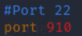

     重启ssh服务

     ```
     systemctl enable ssh.service
     systemctl restart sshd
     ```

     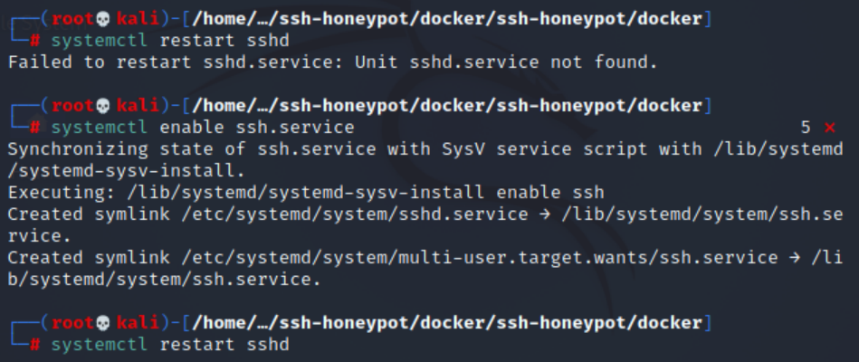

   - 安装docker镜像

     ```
     git clone https://github.com/droberson/ssh-honeypot
     cd ssh-honeypot/docker
     docker-compose build
     ```

     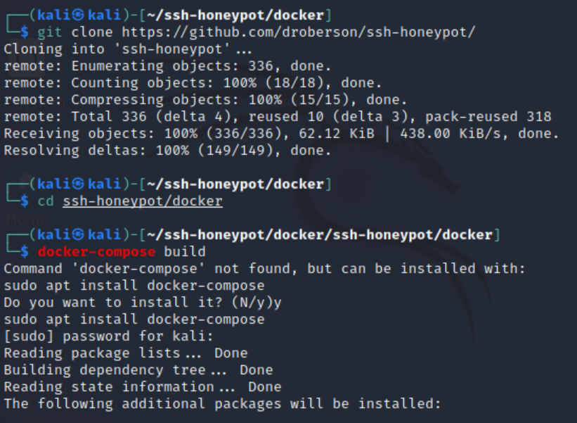

     - 报错：`Unable to fetch some archives, maybe run apt-get update or try with --fix-missing`

     - 解决：`sudo apt-get update`

       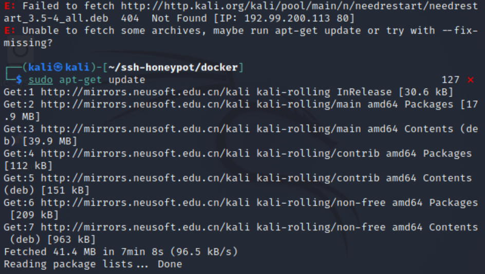

     - ```
       sudo apt install docker-compose
       sudo docker-compose build
       ```

     - 很慢，卡住不动，换源

       ```
       sudo su
       vim Dockerfile
       # 加入语句
       RUN sed -i 's/dl-cdn.alpinelinux.org/mirrors.aliyun.com/g' /etc/apk/repositories
       ```

       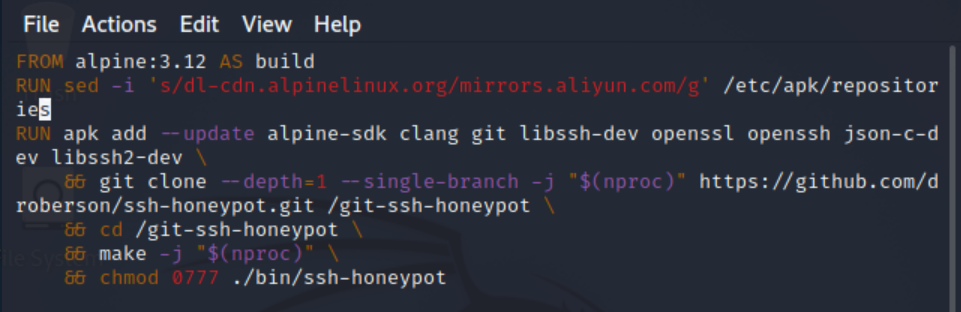

     - 再次尝试，成功

       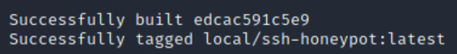

   - 启动并进入容器

     `docker-compose -p ssh-honeypot up`

     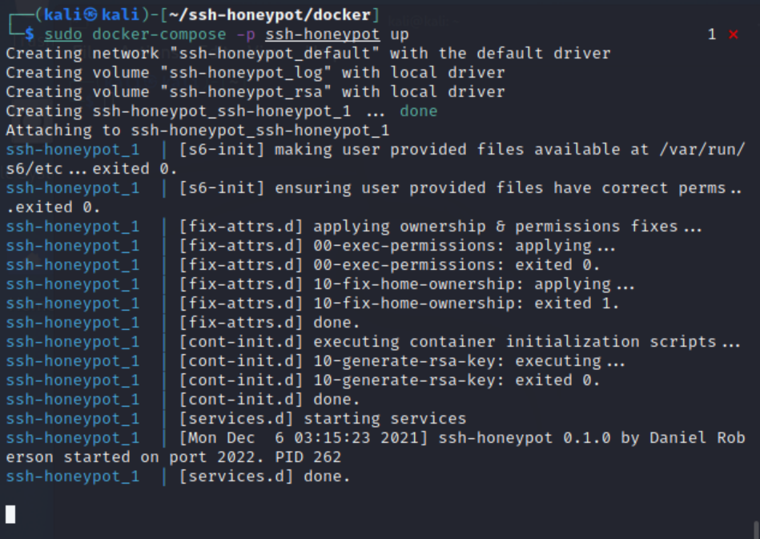

     `sudo docker ps # 查看容器id`

     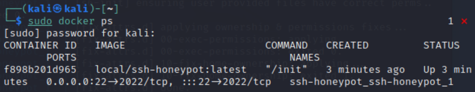

     `docker exec -i -t f898b201d965 /bin/sh`

     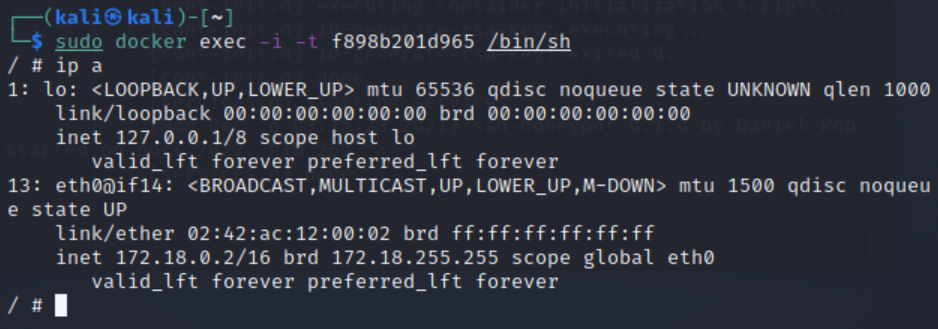

2. 蜜罐测试

   - 查看日志

     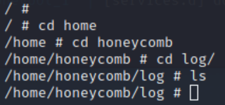

     > 由于此时攻击者并没有任何行为，所以还没有日志信息

   - ssh连接

     - 在Attacker上对Victim进行ssh连接

       `ssh kali@192.168.79.13 -p 22`

       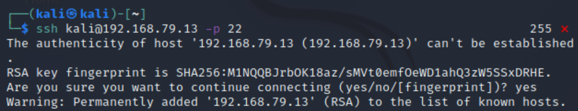

     - 此时查看蜜罐中的log会发现有日志信息更新，可以看到日志中记录了攻击事件、攻击时间、攻击者ip、ssh时输入的用户名密码等信息

       > 同时在Attacker上发现无论输入什么密码都无法连接成功，说明该蜜罐只是一个低交互的蜜罐，只能开放简单服务和端口，无法提供进一步的交互动作

   - nmap
   
     - 在Attacker上进行nmap扫描
     
       `nmap 192.168.79.13`
     
       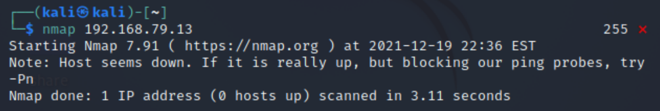
     
     - Victim: 这时在蜜罐日志中并没有看到信息，说明该ssh蜜罐只会记录与ssh相关的行为

#### cowire

1. 蜜罐搭建

   - 安装docker镜像

     ```
     git clone https://github.com/cowrie/docker-cowrie
     cd docker-cowrie
     ```
     
   - 启动容器

     `docker run -p 2222:2222 cowrie/cowrie`
     
     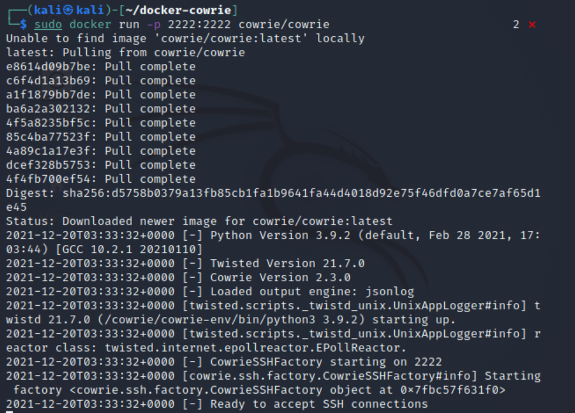

2. 蜜罐测试

   - ssh链接

     - 在Attacker上对Victim进行ssh连接

       `ssh -p 2222 root@192.168.79.13`

       > 此时任意输入一个密码都可以成功连接

       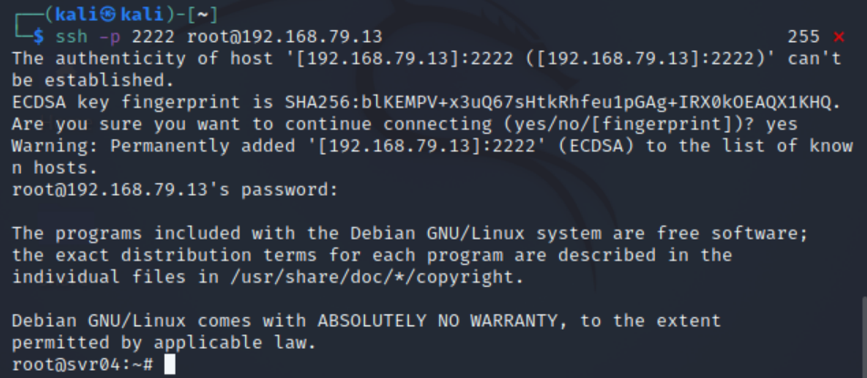

       但是一会后链接会自动断开

       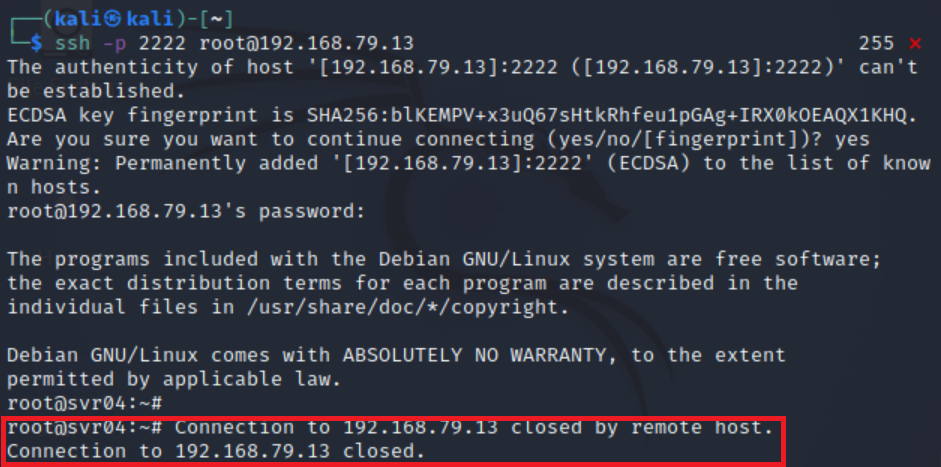

       再次随意输入一个密码也能连接成功，但一段时间后又会自动断开

     - 在蜜罐中可以查看到Attacker的攻击信息

       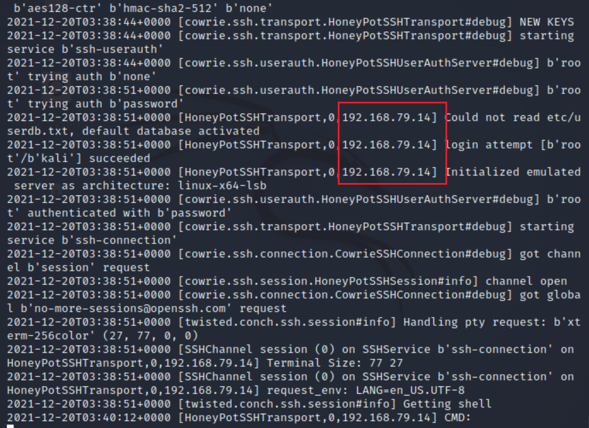

   - 在Attacker中以root身份ssh连接上蜜罐以后，可以输入命令模拟攻击

     - ping一些网站名发现不管ping什么都能ping通

       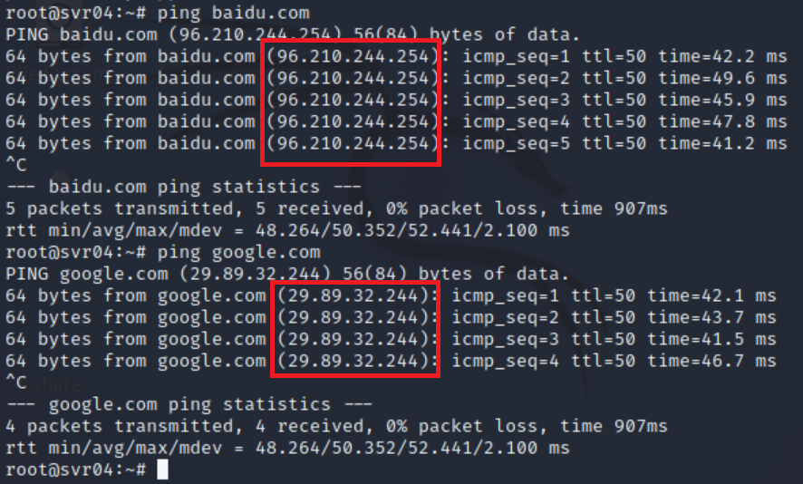

       我们在本机中ping以上网站，对比结果可以猜测蜜罐中ping的结果都是随意设置的

       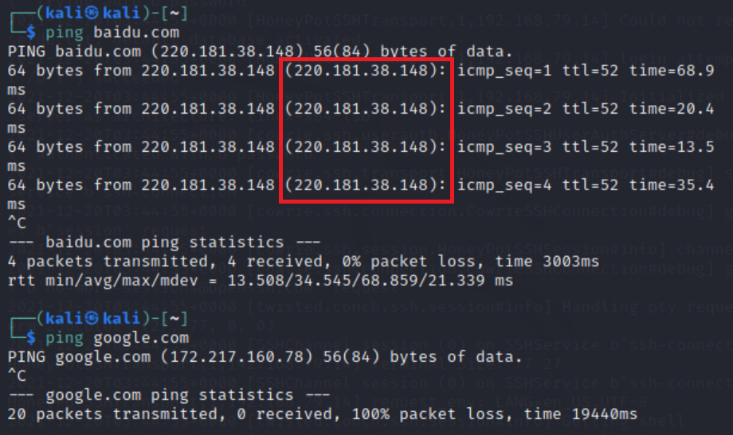
     
     - 执行apt-get命令时显示permission denied，但此时登陆的明明是root用户，明显露馅
     
       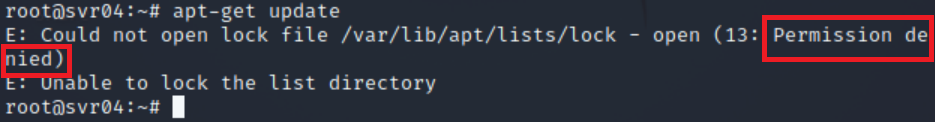
     
     - Victim的蜜罐中可以看到来自攻击者主机的各种命令记录
     
       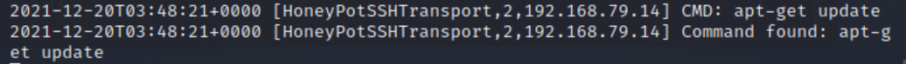

3. nmap扫描

   - attacker
   
     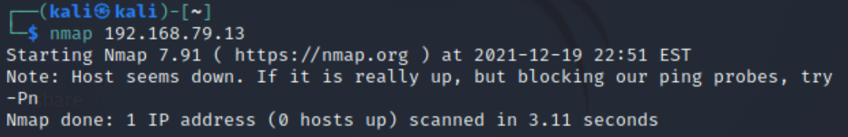
   
   - victim：容器中没有nmap记录

### 问题及解决

1. Kali 虚拟机经过 Virtualbox 的多重加载克隆出来的虚拟机会拥有相同的 /etc/machine-id

   ```cmd
   # Virtualbox 的多重加载镜像机制克隆出来的虚拟机使用的虚拟磁盘，磁盘 uuid 值是相同的 
   sudo blkid /dev/sda1 
   # /dev/sda1: UUID="dff30eeb-7332-438d-964c-d5c7f4d357f7" BLOCK_SIZE="4096" TYPE="ext4" PARTUUID="f0f6b9b0-01" 
   
   ls -l /dev/disk/by-uuid 
   # lrwxrwxrwx 1 root root 10 Dec  3 00:32 dff30eeb-7332-438d-964c-d5c7f4d357f7 -> ../../sda1 
   # /etc/machine-id 的值与磁盘 uuid 值无关 
   # 局域网中，【不同主机】的磁盘分区 uuid 值相同无影响，但要避免 machine-id 值重复 
   # machine-id 重复的一个最直接影响是对于使用 Net-Plan 方式进行 DHCP 获取 IP 地址的客户端来说，缺省 DHCP 请求策略会导致局域网中出现 IP 地址冲突 
   # 除此之外，对于分布式集群系统来说，重复 machine-id 可能会导致一些不确定性错误 
   # ref-1: https://unix.stackexchange.com/questions/402999/is-it-ok-to-change-etc-machine-id 
   # ref-2: https://documentation.suse.com/external-tree/en-us/suma/4.0/suse-manager/administration/tshoot-registerclones.html 
   # TL;DR 对于 Debian 及其衍生发行版系统 /etc/machine-id 的值是在系统启动时拷贝自 /var/lib/dbus/machine-id sudo rm /var/lib/dbus/machine-id /etc/machine-id 
   
   ## ref-1 的方法 
   sudo dbus-uuidgen --ensure=/etc/machine-id 
   # 从 /etc/machine-id 拷贝内容到 /var/lib/dbus/machine-id sudo dbus-uuidgen --ensure 
   
   ## ref-2 的方法 
   # 当 /etc/machine-id 内容为空或文件缺失时，创建 /var/lib/dbus/machine-id 并写入 machine-id 
   sudo dbus-uuidgen --ensure 
   # 从 /var/lib/dbus/machine-id 拷贝内容到 /etc/machine-id sudo systemd-machine-id-setup 
   # 以上 ref-1 和 ref-2 的方法在 Kali 上效果相同 
   
   # 验证 machine-id 
   cat /etc/machine-id 
   cat /var/lib/dbus/machine-id 
   
   # 重启系统，以确保配置变更生效 
   sudo reboot
   ```

### 参考

[Linux课程课件](https://c4pr1c3.gitee.io/linuxsysadmin/cloud-init.md.html#/machine-id-4)